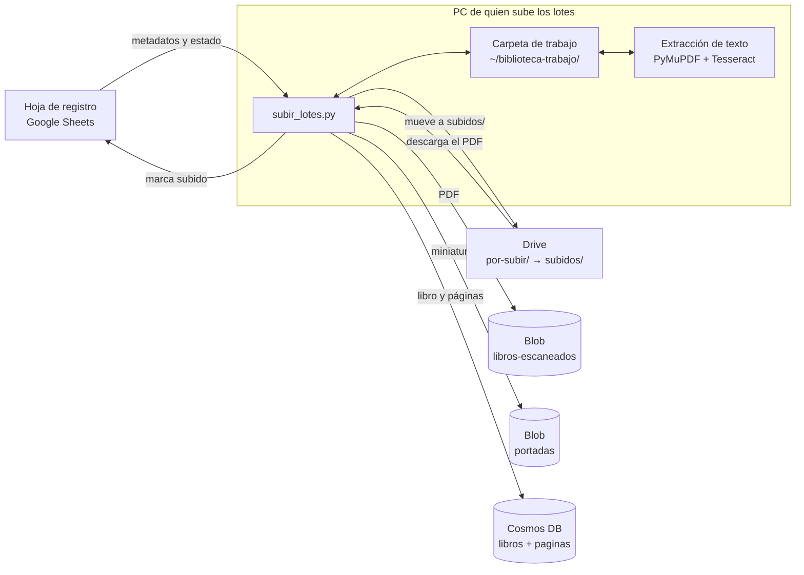
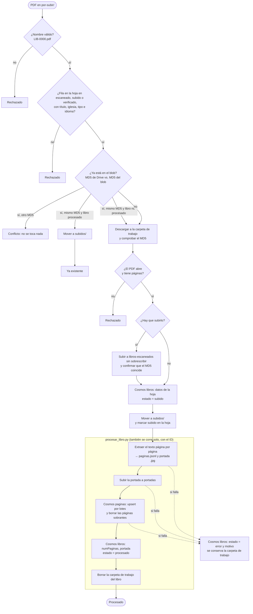

# Pipeline de digitalización

Describe el camino de un libro desde que se escanea hasta que está en Azure. Ver el stack en [stack-tecnologico.md](stack-tecnologico.md) y el avance en [progreso.md](progreso.md).

> Estado: **borrador**. Están confirmados el nombre del PDF, los bloques de IDs por persona, los estados de la hoja de registro y el flujo de subida y procesamiento (acordado el 2026-10-04, todavía sin probar). El flujo de quien escanea sigue siendo una propuesta.

## Reparto y nombres

- Escanean **4 personas**, con un bloque de 750 IDs cada una: `LIB-0001` a `LIB-0750`, `LIB-0751` a `LIB-1500`, `LIB-1501` a `LIB-2250` y `LIB-2251` a `LIB-3000`. Quién tiene cada bloque está en la pestaña `Bloques` de la hoja de registro.
- El ID lo asigna la **hoja de registro** antes de escanear. Nadie lleva su propia cuenta.
- El PDF se llama igual que el ID: `LIB-0770.pdf`. Formato `^LIB-\d{4}\.pdf$`: prefijo en mayúsculas, un guion, 4 dígitos, sin espacios ni sufijos como `final` o `v2`.
- Un PDF es un libro completo. Cada tomo es un libro y lleva su propio ID.
- La portada es la primera página. Se escanea todo, incluidas las hojas en blanco y la contraportada.

## Hoja de registro

Hoja de Google Sheets con cinco pestañas: `Registro` (los 3000 IDs con título, autor, iglesia, fecha, año desde, año hasta, tipo, idioma, responsable, estado, fecha de escaneo, páginas y notas), `Bloques`, `Resumen` (avance por estado y por persona), `Guía` y `Listas` (los valores permitidos de `Tipo` e `Iglesia`). El responsable de cada fila se calcula solo a partir del bloque, y `Año desde` y `Año hasta` salen de la `Fecha`. `Tipo` e `Iglesia` son desplegables de lista cerrada.

Las listas parten de una decisión y un supuesto. Decidido el 2026-10-04: todos los libros son impresos. Supuesto por confirmar: "iglesia" es la denominación (por ejemplo `Iglesia Católica`) y no la parroquia. `Tipo` tiene 11 valores, incluido `Otro`. Con la decisión de libros impresos se quitó de la lista el tipo `Registros parroquiales` (2026-10-04). Idiomas de los libros: español e inglés (decidido el 2026-10-04). El idioma de cada libro se elige en la columna `Idioma` (desplegable de `Español` e `Inglés`) y decide con qué modelo lee el OCR: `spa` para español y `eng` para inglés.

Estados y quién los cambia:

| Estado | Significado | Quién lo cambia |
|---|---|---|
| `pendiente` | Libro sin escanear. Valor por defecto. | Nadie |
| `en curso` | Se está escaneando. | Quien escanea |
| `escaneado` | El PDF ya está listo para subir: en `por-subir/` de Drive, o descargado de Internet Archive si es un libro digital. | Quien escanea |
| `subido` | El PDF ya está en Azure. | Quien sube los lotes |
| `verificado` | Se comprobó que el PDF abre y tiene todas las páginas. | Quien sube los lotes |
| `con problema` | Libro dañado o incompleto. Se explica en Notas y no se sube. | Quien escanea |

## Flujo de quien escanea (propuesta)

1. Toma el siguiente ID `pendiente` de su bloque y marca `en curso`.
2. Llena título, autor (si el libro lo tiene), iglesia, fecha, tipo e idioma, y etiqueta el libro físico con el ID. El autor va en su propia columna, no dentro del título.
3. Escanea en orden con la app del celular, empezando por la portada, y revisa las páginas dentro de la app.
4. Guarda el documento con el nombre exacto `LIB-0770`, que se exporta como PDF.
5. Exporta el PDF a la carpeta compartida `por-subir/` de Drive y comprueba que apareció con ese nombre.
6. Actualiza la hoja: páginas, fecha de escaneo y estado `escaneado`.
7. El PDF se queda en el celular hasta que el libro pase a `verificado`.

## Subida y procesamiento: flujo completo (acordado el 2026-10-04)

Código en [`pipeline/`](../pipeline/): `subir_lotes.py`, `procesar_libro.py` y sus módulos. Preparación y uso en [`pipeline/README.md`](../pipeline/README.md).

Un solo script, `subir_lotes.py`, corre en la PC de quien sube los lotes. Recibe los PDF de `por-subir/`, los sube a Blob, extrae el texto **en la PC** y guarda todo en Cosmos. No hay disparador en la nube: no se usan Event Grid ni Azure Functions, ni se gasta crédito en CPU. Un segundo script, `procesar_libro.py`, repite solo la extracción y Cosmos para un libro ya subido. Sirve para reintentar los libros en `error` o para reprocesarlos.

Principios:

- **Primero se sube y después se extrae el texto.** Si la extracción falla, el PDF ya está a salvo en Azure y solo se repite la extracción.
- **Los duplicados se comprueban antes de descargar y de extraer**, comparando el MD5 que da Drive con el del blob. Así no se gasta tiempo en un libro que ya está.
- **Un archivo solo se mueve a `subidos/` después de confirmar que está en Blob.**
- **Cosmos se actualiza al final.** El libro pasa a `procesado` solo cuando ya tiene páginas y portada.
- **El script crea el registro del libro en `libros`** con los datos de la hoja de registro, en el momento de subirlo. Así el texto nunca llega antes que el libro.

### Vista general



### Flujo de cada libro



### Paso a paso

**0. Preparación (una vez por corrida).** Se conecta a Drive, a la hoja, a Blob y a Cosmos. Si alguna conexión falla, se detiene antes de tocar nada. Lee de una sola vez la lista de `por-subir/` (con el `md5Checksum` que da Drive), la pestaña `Registro` de la hoja (las columnas se leen por el nombre del encabezado, no por la letra), los blobs de `libros-escaneados` con su MD5 y el `estado` de los libros que ya están en Cosmos.

**1. Validar el nombre.** Debe cumplir `^LIB-\d{4}\.pdf$`. Si no, el archivo se rechaza y no se descarga.

**2. Validar la fila de la hoja.** Debe existir, estar en `escaneado` (o en `subido` o `verificado`, si el archivo se vuelve a poner en `por-subir/`) y tener título, iglesia, tipo e idioma. `Español` se convierte en `es` y `Inglés` en `en`. Si no se cumple, el libro se rechaza con el motivo.

**3. Comprobar duplicados.** No hace falta descargar nada:

| Situación | Qué hace | Resultado en el reporte |
|---|---|---|
| No está en el blob | Flujo completo | `subido` |
| Está, con el mismo MD5, y el libro está `procesado` en Cosmos | Solo lo mueve a `subidos/` | `ya existente` |
| Está, con el mismo MD5, y el libro **no** está procesado | Se salta la subida y sigue con Cosmos y la extracción (retoma un intento que falló) | `retomado` |
| Está, con **otro** MD5 | No sube, no mueve y no toca Cosmos | `conflicto` |

**4. Descargar y validar el PDF.** Se descarga a `~/biblioteca-trabajo/LIB-0770/LIB-0770.pdf` y se comprueba que el MD5 coincide con el de Drive. Después se comprueba con PyMuPDF que el PDF abre y tiene páginas. Si el número de páginas no coincide con la columna `Páginas` de la hoja, se anota como **advertencia** y el libro no se detiene.

**5. Subir a Blob.** Se sube con `overwrite=False`: si el blob apareció mientras tanto, Azure rechaza la subida en vez de sobrescribir. Se guarda el MD5 en `Content-MD5`, porque el SDK no lo pone solo en las subidas por partes. Después se lee el blob y se confirma que existe y que su MD5 coincide.

**6. Registro del libro en Cosmos.** Hace un upsert en `libros` con los datos de la hoja: título, autor, iglesia, tipo, idioma, fecha y años. También guarda `pdf` y `estado = subido`. Si el documento ya existía, conserva los campos que no vienen de la hoja, como `capitulos` y `descripcion`. Va antes de mover el archivo: si falla, el archivo sigue en `por-subir/` y la siguiente corrida lo retoma.

**7. Mover y marcar.** Mueve el archivo de `por-subir/` a `subidos/` en Drive y pone el estado `subido` en la hoja. Nunca borra nada en Drive. Si falla solo la escritura en la hoja, el libro sigue adelante y se anota una advertencia.

**8. Extraer el texto (`procesar_libro.py`).** Página por página:

- Si la página ya trae una capa de texto, como los PDF de Internet Archive, el texto se toma directo con PyMuPDF (`ocr.motor = "pdf-texto"`). Se considera que tiene capa si trae al menos 20 caracteres que no sean espacios.
- Si no, la página se convierte en imagen a 300 dpi y pasa por Tesseract con `spa` o `eng` según el idioma del libro (`ocr.motor = "tesseract"`, con la confianza media de la página).
- Cada página se agrega como una línea a `paginas.jsonl` apenas termina. Si el script se cae, al volver a correrlo continúa desde la última página guardada, siempre que el MD5 del PDF sea el mismo.
- De la página 1 sale la miniatura `LIB-0770.jpg`, en JPEG de 500 px de ancho.
- La opción `--forzar-ocr` ignora la capa de texto y pasa todas las páginas por Tesseract.

Carpeta de trabajo de cada libro, fuera del repo:

```
~/biblioteca-trabajo/
├── LIB-0770/
│   ├── LIB-0770.pdf      ← PDF descargado de Drive (o de Blob, si se reprocesa)
│   ├── meta.json         ← MD5 del PDF, número de páginas e idioma, para saber si se puede retomar
│   ├── paginas.jsonl     ← una línea por página, con el documento listo para Cosmos
│   └── LIB-0770.jpg      ← miniatura de la portada
└── reportes/
    └── 2026-10-04_1830.csv
```

**9. Subir la portada** a `portadas`. Aquí sí se sobrescribe, porque la portada se genera a partir del PDF.

**10. Guardar las páginas en Cosmos.** Hace upsert de las líneas de `paginas.jsonl` en `paginas`, en lotes transaccionales de 25 operaciones de la misma partición `bookId`. Cosmos permite hasta 100 por lote, pero cada página cuesta unos 13 RU o más, y un lote de 100 pide más que los 1000 RU/s de la base (en la primera corrida real dio errores 429). Cada página lleva copiados `iglesia`, `tipo`, `anioDesde` y `anioHasta`. Después borra las páginas cuyo `numero` sea mayor que el total actual (por si fue un reescaneo). El SDK reintenta los errores 429 por exceso de RU durante un máximo de 5 minutos (por defecto se rinde a los 30 segundos).

**11. Cerrar el libro.** Actualiza `libros` con `numPaginas`, `portada` y `estado = procesado`, y borra el campo `error` si existía.

**12. Limpiar.** Borra la carpeta de trabajo del libro. Si cualquier paso del 8 al 11 falló, el libro queda en `estado = error` con el motivo en el campo `error`, la carpeta se conserva y el script sigue con el siguiente libro.

**Al final de la corrida** imprime y guarda un reporte CSV con una fila por archivo: ID, resultado (`procesado`, `ya existente`, `retomado`, `conflicto`, `rechazado` o `error`), motivo, advertencias, páginas y método de extracción.

### Opciones previstas

| Opción | Qué hace |
|---|---|
| `--dry-run` | Hace las validaciones y la comprobación de duplicados, y muestra lo que haría, sin descargar, subir, mover ni escribir |
| `--limit N` | Procesa como máximo N libros |
| `--solo LIB-0001,LIB-0002` | Procesa solo esos IDs |
| `--workers N` | Libros en paralelo, uno por proceso (por defecto 4; la PC de pruebas tiene 16 núcleos) |
| `--forzar-ocr` | Pasa todas las páginas por Tesseract aunque tengan capa de texto |
| `--sin-texto` | Solo sube, mueve y registra el libro en `estado = subido`; la extracción se hace después con `procesar_libro.py` |

`procesar_libro.py LIB-0770 [--forzar-ocr]` corre los pasos 8 a 12 para un libro que ya está en Blob. Si no hay copia local, descarga el PDF de Blob.

### Garantías

- Nunca sobrescribe un PDF en Blob.
- No mueve un archivo en Drive sin confirmar antes que está en Blob, y nunca borra nada en Drive.
- Correrlo dos veces no duplica nada: los IDs son fijos y Cosmos usa upsert.
- Un libro con error no frena a los demás.
- No imprime llaves ni tokens. En Azure se autentica con `az login` (`DefaultAzureCredential`); en Google, con un token OAuth guardado fuera del repo.

### Requisitos para probarlo

- [x] Tesseract con español e inglés en la PC (5.5.3, instalado el 2026-10-04).
- [x] Rol de datos de Cosmos para el usuario (`Cosmos DB Built-in Data Contributor`), asignado el 2026-10-04 y verificado con una lectura desde el script.
- [x] Proyecto de Google Cloud con las API de Drive y de Sheets activadas y un cliente OAuth de escritorio. `credentials.json` está en `~/.config/biblioteca-virtual/` desde el 2026-10-04; `token.json` se crea en la primera autorización.
- [x] Carpetas `por-subir/` y `subidos/` en Drive, dentro de `biblioteca virtual`, con los 5 PDF de prueba en `por-subir/` (2026-10-04).

## Pendiente por definir

- [ ] App de escaneo del celular (probar con un libro piloto: ajustes, nombre del archivo exportado y límite de páginas por documento)
- [ ] Servicio de la carpeta compartida (Drive u OneDrive) y permisos para que quien sube pueda mover los archivos de los demás
- [ ] Quién sube los lotes a Azure
- [ ] Modo de reemplazos: cómo se sube un libro reescaneado cuando el blob ya existe con otro MD5. Hoy se reporta como conflicto y no se toca
- [x] ~~Alcance de la primera versión del script~~ → 2026-10-04: valida con PyMuPDF, marca `subido` en la hoja y crea el libro en Cosmos. Ver "Subida y procesamiento"
- [x] ~~Quién crea el registro de cada libro en Cosmos DB~~ → 2026-10-04: `subir_lotes.py`, con los datos de la hoja, al subir el PDF (paso 7)
- [ ] Revisar las listas de `Tipo` e `Iglesia` después de los primeros 100 libros (cuántos cayeron en `Otro`)
- [x] ~~OCR, dónde corre y cómo se dispara~~ → 2026-10-04: en la PC de quien sube, dentro del mismo script, sin disparador en la nube
- [ ] Medir con el libro piloto el tiempo de extracción por página y la calidad de Tesseract frente a la capa de texto de Internet Archive
